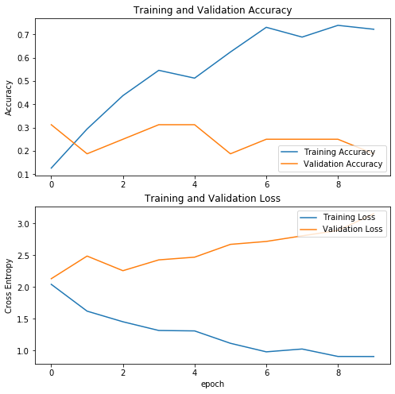
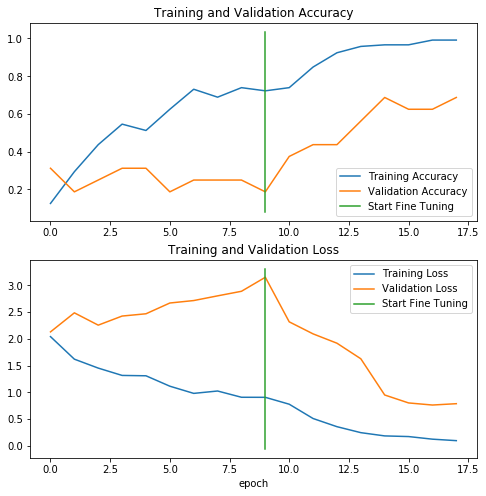

# Recognize US Dollar Bills

Use Transfer Learning and Convolutional Nets to train a model to detect the dollar value of a US Bill

### Import the necessary packages


```python
import IPython.display as display
from PIL import Image
import numpy as np
import matplotlib.pyplot as plt
import os
import pathlib

import tensorflow as tf
print(f"Tensorflow Version: {tf.__version__}")
```

    /usr/lib/python3.6/importlib/_bootstrap.py:219: ImportWarning: can't resolve package from __spec__ or __package__, falling back on __name__ and __path__
      return f(*args, **kwds)
    /usr/local/lib/python3.6/dist-packages/tensorflow_core/python/keras/backend.py:5879: ResourceWarning: unclosed file <_io.TextIOWrapper name='/root/.keras/keras.json' mode='r' encoding='UTF-8'>
      _config = json.load(open(_config_path))


    Tensorflow Version: 2.1.0


### Load data from disk


```python
# location of image data. Directories of images, with one class of images per direcotry
data_dir = pathlib.Path('/storage/data/us-bills-data/images-orig/')
```


```python
image_count = len(list(data_dir.glob('*/*.jpg')))
print(f"Number of images = {image_count}")
```

    Number of images = 165


```python
# get the names of classes as a list
image_classes = np.array([item.name for item in data_dir.glob('USD*')])
print(f"Image Classes = {image_classes}")
```

    Image Classes = ['USD-10' 'USD-50' 'USD-5' 'USD-20' 'USD-1' 'USD-100']


### Load images using Keras

- Resize to `224x224`
- Get image in batches of size `16`
- Scale the image pixel values `between [0,1]`
- Augment the training images
    - rotation_range = 40
    - horizontal_flip = True
    - width_shift_range = 0.2
    - height_shift_range = 0.2
    - shear_range = 0.2
    - zoom_range = 0.2
    - allow shuffling


```python
IMAGE_SIZE = (224, 224) # height, width
BATCH_SIZE = 16
```


```python
datagen_args = dict(rescale=1./255,
                    validation_split=0.20)
dataflow_args = dict(target_size=IMAGE_SIZE,
                     batch_size=BATCH_SIZE,
                     interpolation='bilinear')
```


```python
# Validation data generator and flow
valid_datagen = tf.keras.preprocessing.image.ImageDataGenerator(**datagen_args)
valid_generator = valid_datagen.flow_from_directory(
    data_dir, 
    subset="validation", 
    shuffle=False, 
    **dataflow_args)

# Train data generator, with augmentation and train flow
train_datagen = tf.keras.preprocessing.image.ImageDataGenerator(
      rotation_range=40,
      horizontal_flip=True,
      width_shift_range=0.2, height_shift_range=0.2,
      shear_range=0.2, zoom_range=0.2,
      **datagen_args)
train_generator = train_datagen.flow_from_directory(
    data_dir, 
    subset="training", 
    shuffle=True, 
    **dataflow_args)
```

    Found 31 images belonging to 6 classes.
    Found 135 images belonging to 6 classes.


### Visualize the training images

Visualize one batch, i.e., 16 images, of the training set from the training generator


```python
# First let's get the indices assigned to each class labels for reference
train_generator.class_indices
```


    {'USD-1': 0, 'USD-10': 1, 'USD-100': 2, 'USD-20': 3, 'USD-5': 4, 'USD-50': 5}


```python
visualize_train_images, _  = next(train_generator)
```

The `next` function returns a batch from the dataset. The return value of next function is in form of `(x_train, y_train)` where x_train is training features and y_train, its labels.


```python
# Inspect the shape of the batch of data
print(f"Shape of 1 image batch = {visualize_train_images.shape}")
```

    Shape of 1 image batch = (16, 224, 224, 3)


```python
# This function will plot images in the form of a grid with 1 row and 6 columns
def plotImages(images_arr):
    fig, axes = plt.subplots(1, 6, figsize=(20,20))
    axes = axes.flatten()
    for img, ax in zip(images_arr, axes):
        ax.imshow(img)
        ax.axis('off')
    plt.tight_layout()
    plt.show()
```


```python
plotImages(visualize_train_images[:6])
```


### Training the model

We'll use Resnet50 model as the base model


```python
IMAGE_SHAPE = (IMAGE_SIZE[0],IMAGE_SIZE[1],3) # RGB image with 3 channels

# Create the base model with pre-trained Resnet50 V2
base_model = tf.keras.applications.ResNet50V2(input_shape=IMAGE_SHAPE,
                                              include_top=False,
                                              weights='imagenet')
```


```python
feature_batch = base_model(visualize_train_images)
print(f"Shape of extracted features on 1 batch from the base model = {feature_batch.shape}")
```

    Shape of extracted features on 1 batch from the base model = (16, 7, 7, 2048)


It is important to freeze the convolutional base before starting to compile and train the model. Freezing (by setting `layer.trainable = False`) prevents the weights in a given layer from being updated during training. ResNet50V2 has many layers, so setting the entire model's trainable flag to **False** will freeze all the layers.


```python
# Freeze the pre-trained model weights
base_model.trainable = False
```


```python
# let's look at our base model's architecture
base_model.summary()
```

    Model: "resnet50v2"
    (Removed architecture to save space)
    ==================================================================================================
    Total params: 23,564,800
    Trainable params: 0
    Non-trainable params: 23,564,800
    __________________________________________________________________________________________________


### Add classification Layers

To generate predictions from the block of features, average over the spatial locations, using a tf.keras.layers.GlobalAveragePooling2D layer to convert the features to a single 2048-element vector per image.


```python
global_average_layer = tf.keras.layers.GlobalAveragePooling2D()
feature_batch_average = global_average_layer(feature_batch)
print(f"Shape of extracted features on 1 batch after adding global avg pooling layer2D = {feature_batch_average.shape}")
```

    Shape of extracted features on 1 batch after adding global avg pooling layer2D = (16, 2048)


Now apply a Dense layer to convert these features into a single prediction per image. We'll use a softmax activation to predict the class with the maximum probability


```python
prediction_layer = tf.keras.layers.Dense(len(image_classes),activation='softmax')
prediction_batch = prediction_layer(feature_batch_average)
print(f"Shape of extracted features on 1 batch after adding the final prediction layer with softmax = {prediction_batch.shape}")
```

    Shape of extracted features on 1 batch after adding the final prediction layer with softmax = (16, 6)


We get the output as a list of probabilities of each class, 6 in this case

### Build and Compile our final model

Stack all the layers of the feature extractor to make the final model


```python
model = tf.keras.Sequential([
    base_model,
    global_average_layer,
    prediction_layer
])
```

You must compile the model before training it. Since there are more than 2 classes, we'll use a categorical cross-entropy loss. 

*Notice I use categorical_crossentropy here because each label is represented by a one-hot vector. One should use sparse_categorical_crossentropy if a single value (index of the class) represents each label.*


```python
model.compile(optimizer='adam',
              loss='categorical_crossentropy',
              metrics=['accuracy'])
model.summary()
```

    Model: "sequential"
    _________________________________________________________________
    Layer (type)                 Output Shape              Param #   
    =================================================================
    resnet50v2 (Model)           (None, 7, 7, 2048)        23564800  
    _________________________________________________________________
    global_average_pooling2d (Gl (None, 2048)              0         
    _________________________________________________________________
    dense (Dense)                (None, 6)                 12294     
    =================================================================
    Total params: 23,577,094
    Trainable params: 12,294
    Non-trainable params: 23,564,800
    _________________________________________________________________


The 23.5M parameters in ResNet50V2 are frozen, but there are 12K trainable parameters in the Dense layer. These are divided between two tf.Variable objects, the *weights and biases*.

### Train the model


```python
INITIAL_EPOCHS = 10
STEPS_PER_EPOCH = train_generator.samples // train_generator.batch_size
VALIDATION_STEPS = valid_generator.samples // valid_generator.batch_size

loss0, accuracy0 = model.evaluate(valid_generator, steps=VALIDATION_STEPS)

print(f"initial loss: {loss0}")
print(f"initial accuracy: {accuracy0}")
```

    WARNING:tensorflow:sample_weight modes were coerced from
      ...
        to  
      ['...']
    1/1 [==============================] - 5s 5s/step - loss: 2.7091 - accuracy: 0.0625
    initial loss: 2.709122657775879
    initial accuracy: 0.0625


```python
history = model.fit(train_generator,
                    epochs=INITIAL_EPOCHS,
                    steps_per_epoch = STEPS_PER_EPOCH,
                    validation_data=valid_generator,
                    validation_steps=VALIDATION_STEPS)
```

    WARNING:tensorflow:sample_weight modes were coerced from
      ...
        to  
      ['...']
    WARNING:tensorflow:sample_weight modes were coerced from
      ...
        to  
      ['...']
    Train for 8 steps, validate for 1 steps
    Epoch 1/10
    8/8 [==============================] - 27s 3s/step - loss: 2.0199 - accuracy: 0.1261 - val_loss: 2.1319 - val_accuracy: 0.3125
    Epoch 2/10
    8/8 [==============================] - 24s 3s/step - loss: 1.6002 - accuracy: 0.2941 - val_loss: 2.4881 - val_accuracy: 0.1875
    Epoch 3/10
    8/8 [==============================] - 25s 3s/step - loss: 1.4546 - accuracy: 0.4375 - val_loss: 2.2579 - val_accuracy: 0.2500
    Epoch 4/10
    8/8 [==============================] - 23s 3s/step - loss: 1.3206 - accuracy: 0.5462 - val_loss: 2.4280 - val_accuracy: 0.3125
    Epoch 5/10
    8/8 [==============================] - 23s 3s/step - loss: 1.2879 - accuracy: 0.5126 - val_loss: 2.4706 - val_accuracy: 0.3125
    Epoch 6/10
    8/8 [==============================] - 25s 3s/step - loss: 1.1159 - accuracy: 0.6250 - val_loss: 2.6721 - val_accuracy: 0.1875
    Epoch 7/10
    8/8 [==============================] - 22s 3s/step - loss: 0.9731 - accuracy: 0.7311 - val_loss: 2.7180 - val_accuracy: 0.2500
    Epoch 8/10
    8/8 [==============================] - 23s 3s/step - loss: 1.0130 - accuracy: 0.6891 - val_loss: 2.8058 - val_accuracy: 0.2500
    Epoch 9/10
    8/8 [==============================] - 24s 3s/step - loss: 0.8961 - accuracy: 0.7395 - val_loss: 2.8913 - val_accuracy: 0.2500
    Epoch 10/10
    8/8 [==============================] - 24s 3s/step - loss: 0.8837 - accuracy: 0.7227 - val_loss: 3.1533 - val_accuracy: 0.1875


```python
acc = history.history['accuracy']
val_acc = history.history['val_accuracy']

loss = history.history['loss']
val_loss = history.history['val_loss']

plt.figure(figsize=(8, 8))
plt.subplot(2, 1, 1)
plt.plot(acc, label='Training Accuracy')
plt.plot(val_acc, label='Validation Accuracy')
plt.legend(loc='lower right')
plt.ylabel('Accuracy')
plt.title('Training and Validation Accuracy')

plt.subplot(2, 1, 2)
plt.plot(loss, label='Training Loss')
plt.plot(val_loss, label='Validation Loss')
plt.legend(loc='upper right')
plt.ylabel('Cross Entropy')
plt.title('Training and Validation Loss')
plt.xlabel('epoch')
plt.show()
```





Validation loss is much higher than the training loss, which suggests there is some *overfitting* here. This maybe because of the small size of the dataset.

### Fine Tuning the model

In the previous experiment, the weights of the pre-trained network - ResNet50V2, were **NOT** updated during training. One way to improve the performance is to train (or fine-tune) the weights of the top layers of the pre-trained model when training the classifier. This will force the weights to be tuned from generic feature mappings to features associated specifically to the dataset.

#### Un-freeze the top layers


```python
base_model.trainable = True # to allow the model layers to be trained again
```


```python
# Let's take a look to see how many layers are in the base model
print(f"Number of layers in the base model: {len(base_model.layers)}")
```

    Number of layers in the base model: 190


```python
# Fine-tune starting from this layer onwards
fine_tune_at = 120

# Freeze all the layers before the `fine_tune_at` layer
for layer in base_model.layers[:fine_tune_at]:
    layer.trainable = False
```

#### Compile the model


```python
LEARNING_RATE=0.0001
model.compile(optimizer=tf.keras.optimizers.Adam(learning_rate=LEARNING_RATE),
              loss='categorical_crossentropy',
              metrics=['accuracy'])
model.summary()
```

    Model: "sequential"
    _________________________________________________________________
    Layer (type)                 Output Shape              Param #   
    =================================================================
    resnet50v2 (Model)           (None, 7, 7, 2048)        23564800  
    _________________________________________________________________
    global_average_pooling2d (Gl (None, 2048)              0         
    _________________________________________________________________
    dense (Dense)                (None, 6)                 12294     
    =================================================================
    Total params: 23,577,094
    Trainable params: 18,337,798
    Non-trainable params: 5,239,296
    _________________________________________________________________


We're training way more parameters this time as we un-freezed the top 70 layers. I start the fine tuning from the last trained epoch in the previous experiment (where the base model was completely frozen). This setting can be adjusted using the `initial_epoch` parameter of the `fit` method


```python
FINE_TUNE_EPOCHS = 7 # when I ran with 10 last time, the validation loss started increasing again after 7.5 epochs

hist_fine = model.fit(train_generator,
                 epochs=INITIAL_EPOCHS+FINE_TUNE_EPOCHS,
                 steps_per_epoch = STEPS_PER_EPOCH,
                 initial_epoch = history.epoch[-1],
                 validation_data=valid_generator,
                 validation_steps=VALIDATION_STEPS)
```

    WARNING:tensorflow:sample_weight modes were coerced from
      ...
        to  
      ['...']
    WARNING:tensorflow:sample_weight modes were coerced from
      ...
        to  
      ['...']
    Train for 8 steps, validate for 1 steps
    Epoch 10/17
    8/8 [==============================] - 28s 3s/step - loss: 0.7675 - accuracy: 0.7395 - val_loss: 2.3200 - val_accuracy: 0.3750
    Epoch 11/17
    8/8 [==============================] - 23s 3s/step - loss: 0.4939 - accuracy: 0.8487 - val_loss: 2.0947 - val_accuracy: 0.4375
    Epoch 12/17
    8/8 [==============================] - 23s 3s/step - loss: 0.3466 - accuracy: 0.9244 - val_loss: 1.9202 - val_accuracy: 0.4375
    Epoch 13/17
    8/8 [==============================] - 23s 3s/step - loss: 0.2377 - accuracy: 0.9580 - val_loss: 1.6289 - val_accuracy: 0.5625
    Epoch 14/17
    8/8 [==============================] - 23s 3s/step - loss: 0.1786 - accuracy: 0.9664 - val_loss: 0.9515 - val_accuracy: 0.6875
    Epoch 15/17
    8/8 [==============================] - 23s 3s/step - loss: 0.1670 - accuracy: 0.9664 - val_loss: 0.8030 - val_accuracy: 0.6250
    Epoch 16/17
    8/8 [==============================] - 23s 3s/step - loss: 0.1194 - accuracy: 0.9916 - val_loss: 0.7637 - val_accuracy: 0.6250
    Epoch 17/17
    8/8 [==============================] - 22s 3s/step - loss: 0.0931 - accuracy: 0.9916 - val_loss: 0.7888 - val_accuracy: 0.6875


Let's take a look at the learning curves of the training and validation accuracy/loss when fine-tuning the last few layers of the ResNet50V2 base model and training the classifier on top of it.


```python
acc += hist_fine.history['accuracy']
val_acc += hist_fine.history['val_accuracy']

loss += hist_fine.history['loss']
val_loss += hist_fine.history['val_loss']
```


```python
plt.figure(figsize=(8, 8))
plt.subplot(2, 1, 1)
plt.plot(acc, label='Training Accuracy')
plt.plot(val_acc, label='Validation Accuracy')
plt.plot([INITIAL_EPOCHS-1,INITIAL_EPOCHS-1],
          plt.ylim(), label='Start Fine Tuning')
plt.legend(loc='lower right')
plt.title('Training and Validation Accuracy')

plt.subplot(2, 1, 2)
plt.plot(loss, label='Training Loss')
plt.plot(val_loss, label='Validation Loss')
plt.plot([INITIAL_EPOCHS-1,INITIAL_EPOCHS-1],
         plt.ylim(), label='Start Fine Tuning')
plt.legend(loc='upper right')
plt.title('Training and Validation Loss')
plt.xlabel('epoch')
plt.show()
```





### Conclusion

Using transfer learning is a neat technique in deep learning which helps in using the weights from a pre-trained model, applied on the current problem at hand. This works well because the initial layers of any model are just trying to identify the very basic features, which can also be used as a basis to help solve other similar problems. The top layers of the model, can then be fine-tuned to learn the specific representations from the problem at hand.

Furthermore, fine-tuning the model can make a significant difference on the model's performance. In the case of this model, after the start of fine-tuning, the validation accuracy started increasing and the validation loss started decreasing thereby giving a better model, which does a great job of recognizing US bills.

**Even with such a small amount of data, transfer learning combined with fine-tuning the top layers, really helped in training a good model.**

### Save the trained model
Finally, save the trained model parameters for use with inference.


```python
saved_model_path = "/storage/models/usbills_resnet50v2_finetuned_init10_fine10-H5"
tf.keras.models.save_model(
    model,
    saved_model_path,
    overwrite=True,
    include_optimizer=True,
    save_format="h5",
    signatures=None,
    options=None
)
```


```python

```
