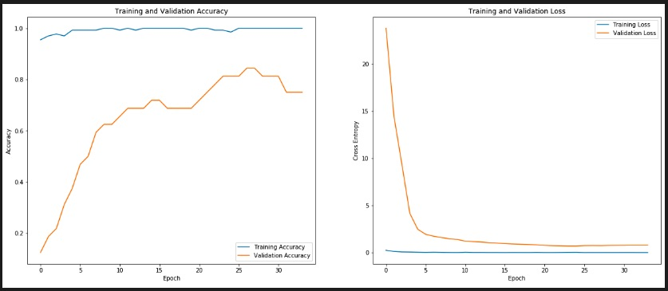

# Recognize US Dollar Bills

***A Flask app to detect the US dollar bill in the image.***

## Blog Posts

- [End-to-End Machine Learning Project: Part-1 (Model Training)](https://towardsdatascience.com/end-to-end-machine-learning-project-part-1-806d04da8deb)
- [End-to-End Machine Learning Project: Part-2 (Model Deployment)](https://towardsdatascience.com/end-to-end-machine-learning-project-627ed48f8109)

## Dataset

- Images of US Dollar bills
- Dataset created using images taken from my phone
- The dataset is in the [imagenet](http://image-net.org/about-overview) format, i.e., set of multiple folders, where each folder name is a class label and the folder itself contains images corresponding to that class
- There are a total of `182 images` in the dataset belonging to `7 classes` (including 'Other' class)
- There are 6 different US Bills to be classified and 1 'Other' class which has some negative samples for the dataset to learn the difference between the US Bill and them. This technique also helps avoid some overfitting.
- Data augmentation techniques were used while training, to supplement the data for training purposes
- Images were `resized to (224, 224)` and image pixel values `rescaled to be between [0,1]` before being used for training and validation
- `80%` of data was used for training and remaining `20%` used for validation

### Dataset Summary

| | |
|:-|:-:|
|Number of images | 182  |
|Number of classes   | 7   |
|Image image dimensions  (used for training and validation)   | (224 x 224 x 3)  |
|Training split | 80% |
|Validation split | 20% |
|Classes | [1, 5, 10, 20, 50, 100, Other]|
| | |

## Model Features

- Model trained using `TensorFlow v2.1.0`
- Uses `data augmentation` techniques to supplement the data
- Uses `Transfer Learning` with weights of pre-trained Convolutional Network (Resnet50 V2)
- Fine tuning the model by un-freezing and retraining the `top 70 layers of Resnet50`
- Inference using model parameters saved in `.pb` format

### Model Architecture

### Model Performance

## App Features

- Python Flask based web app
- Mobile-friendly UI
- Supports image drag-and-drop

## References

- [Building a simple Keras + deep learning REST API](https://blog.keras.io/building-a-simple-keras-deep-learning-rest-api.html)
- [Deploy Keras Model with Flask as Web App in 10 Minutes](https://github.com/mtobeiyf/keras-flask-deploy-webapp)
- [TensorFlow 2.0 Tutorial 01: Basic Image Classification](https://lambdalabs.com/blog/tensorflow-2-0-tutorial-01-image-classification-basics/)
- [Trasfer Learning with a pretrained ConvNet](https://www.tensorflow.org/tutorials/images/transfer_learning)
- [Nginx as reverse proxy for flask app using docker](https://dev.to/ishankhare07/nginx-as-reverse-proxy-for-a-flask-app-using-docker-3ajg)
